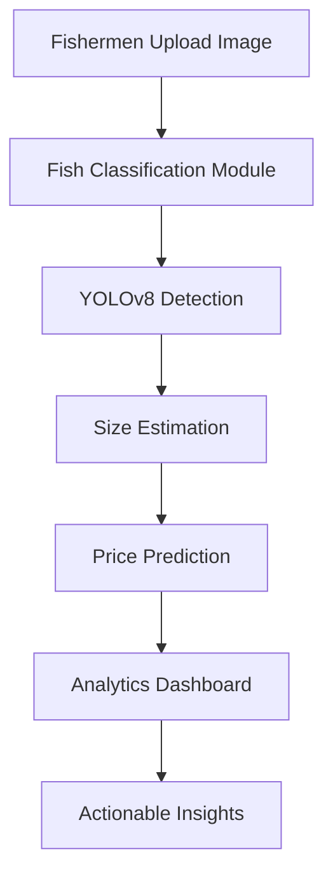

analysis url: https://hackcelestial-kdg-1.onrender.com/api/catches/summary/68cda34fbedae2fb5e505890
              https://hackcelestial-kdg-1.onrender.com/api/catches/weekly/68cda34fbedae2fb5e505890
              https://hackcelestial-kdg-1.onrender.com/api/catches/species/68cda34fbedae2fb5e505890

backend-model :  https://mlservice-146a.onrender.com/
Backend-api : https://hackcelestial-kdg.onrender.com/
Backend-service : https://hackcelestial-kdg-1.onrender.com/

# 🐟 Matsya – Ocean Hazard Analytics

> **A data-driven analytical platform empowering fishermen and marine authorities with intelligent insights for sustainable and profitable fishing operations**


## 🌊 Overview

**Matsya** is an AI-powered ocean analytics platform developed for **Hack Celestial 2.0 Hackathon** at Pillai College of Engineering, Panvel. It combines **Machine Learning**, **Computer Vision**, and **Business Analytics** to revolutionize India's fishing industry by providing:

- 🔍 Automated fish species identification
- 💰 Market price prediction based on fish size
- 📍 Optimal fishing zone recommendations
- 📊 Data-driven insights for sustainable fishing

---

## 🎯 Problem Statement

India's fishing industry faces critical challenges:
- ❌ Unpredictable fish availability
- ❌ Inaccurate price estimation
- ❌ Limited access to profitable fishing zone data
- ❌ Lack of automated fish identification systems

**Matsya** addresses these challenges through intelligent data mining and predictive analytics.

---

## ✨ Key Features

### 🐠 Fish Classification Module
- CNN-based classification model for accurate fish species identification
- Real-time image processing from fishermen's captures

### 📏 Size Detection & Price Prediction
- **YOLOv8** object detection for fish size estimation
- Price prediction using 10+ years of Indian fish market data
- Regression analytics for market price forecasting

### 📈 Business Analytics Dashboard
- Seasonal fish availability trends
- Price fluctuation patterns
- Optimal fishing zone identification
- Region-wise profitability analysis
<p align="center">


</p>


---

## 🏗️ System Architecture


---

## 🛠️ Tech Stack

| Category | Technologies |
|----------|-------------|
| **Programming** | Python,JavaScript, React Native Expo |
| **ML Framework** | TensorFlow, Keras, CNN |
| **Object Detection** | YOLOv8 |
| **Data Analysis** | Pandas, NumPy |
| **Visualization** | Matplotlib, Seaborn, Power BI, Tableau |
| **Analytics** | Clustering, Regression Analysis |
| **Datasets** | Government Fisheries Data, Kaggle |

---

## 🔗 Live Services

### 🌐 Backend Services

- **ML Model Service**: [https://mlservice-146a.onrender.com/](https://mlservice-146a.onrender.com/)
- **Backend API**: [https://hackcelestial-kdg.onrender.com/](https://hackcelestial-kdg.onrender.com/)
- **Analytics Service**: [https://hackcelestial-kdg-1.onrender.com/](https://hackcelestial-kdg-1.onrender.com/)

### 📊 Analysis API Endpoints

#### Summary Analytics:
https://hackcelestial-kdg-1.onrender.com/api/catches/summary/68cda34fbedae2fb5e505890

#### Weekly Catch Data:
https://hackcelestial-kdg-1.onrender.com/api/catches/weekly/68cda34fbedae2fb5e505890


#### Species Distribution:
https://hackcelestial-kdg-1.onrender.com/api/catches/species/68cda34fbedae2fb5e505890


---

## 🚀 Getting Started

### Prerequisites
```bash
Python 3.8+
TensorFlow 2.x
YOLOv8
Pandas, NumPy
```

## 💼 Business Impact

| Stakeholder | Benefits |
|------------|----------|
| **Fishermen** | Informed decisions on what, where, and when to fish for maximum returns |
| **Market Traders** | Improved price forecasting and inventory management |
| **Marine Authorities** | Enhanced understanding of fish population trends and overfishing patterns |

---

## 🎯 Results

✅ High accuracy in fish species classification  
✅ Efficient size detection using YOLOv8  
✅ Minimal error in price prediction vs. actual market rates  
✅ Region-wise profitability patterns identified  
✅ Comprehensive visual dashboards for decision-making  

---

## 🔮 Future Enhancements

- 🛰️ Real-time satellite data integration
- 📱 Mobile application for on-field usability
- 🌍 Multi-language support for regional fishermen
- ⚡ Real-time weather and ocean condition alerts

---

## 📚 References

1. [Government of India – National Fisheries Data Portal](https://fisheries.gov.in/)
2. [Kaggle Fish Species Dataset](https://www.kaggle.com/)
3. [Ultralytics YOLOv8 Documentation](https://docs.ultralytics.com/)
4. [FAO Fisheries and Aquaculture Statistics](http://www.fao.org/fishery/en)

